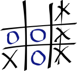

# Learn to play Tic-tac-toe

This document explains how to play tic-tac-toe with a fellow human being. Tic-tac-toe is a fun turn-based game that can be played using a writing instrument (for example, a pencil) and a paper. This document does not include instructions about how to play the game on screen-based devices, such as computers and mobile phones.

## Benefits

Tic-tac-toe players can notice improvements in:

- Hand-eye coordination
- Social interactions
- Strategic thinking

## Before you begin

Tic-tac-toe requires the following for an exciting experience:

- A writing instrument and a paper
- A fellow human being
- The desire to win

## Gameplay

Tic-tac-toe is an easy game to play with simple rules. Before starting the game, the players must choose between two symbols (X and O). During their turn, each player must draw their symbol on a three-by-three grid of squares. The player who draws their symbol three times in a row horizontally, vertically, or diagonally wins the game.

## Instructions

To play tic-tac-toe, follow these steps:

1. Draw a three-by-three grid of squares on the paper. 
2. Start the game. The first player must draw their symbol on an empty square of their choice. Traditionally, the player who chose ‘X’ plays first. 
3. Continue to play the game. The second player must draw their symbol on a different empty square. 
4. Repeat drawing the symbols until a player wins the game by drawing their symbol three times in a row. 

**Note**: If the grid is filled and no player has won, then the game ends in a draw. 

## What's next?

- For more information about tic-tac-toe, see [Tic-tac-toe](https://en.wikipedia.org/wiki/Tic-tac-toe).
- For learning about strategies that can help you win the game, see [How to Win Tic-Tac-Toe: The Strategies You Need to Master](https://www.rd.com/article/how-to-win-tic-tac-toe/).